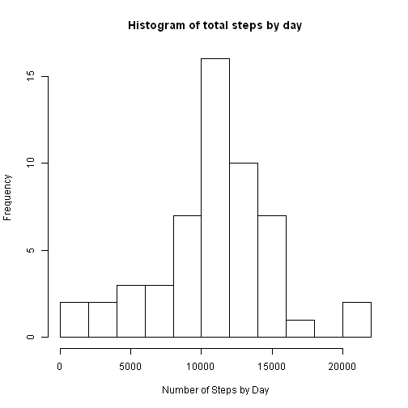
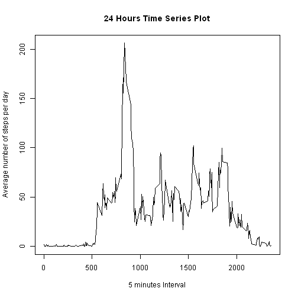

### Introduction

It is now possible to collect a large amount of data about personal movement using  
activity monitoring devices. These types of devices are part of the "quantified self"  
movement -- a group of enthusiasts who take measurements about themselves regularly  
to improve their health, to find patterns in their behavior, or because they are tech  
geeks. But these data remain under utilized both because the raw data are hard to  
obtain and there is lack of statistical methods and software for processing and  
interpreting the data.

### Data

The data for this assignment comes from a personal activity monitoring device. The  
device collects data at 5 minute intervals through out the day. The data consists of  
two months of data from an anonymous individual collected during the months of October  
and November, 2012 and include the number of steps taken in 5 minute intervals each  
day.The dataset can be downloaded from the course web site:
* Dataset: [Activity monitoring data] (https://d396qusza40orc.cloudfront.net/repdata%2Fdata%2Factivity.zip) [52K]

The variables included in this dataset are:

* **steps**: Number of steps taking in a 5-minute interval (missing
    values are coded as `NA`)

* **date**: The date on which the measurement was taken in YYYY-MM-DD
    format

* **interval**: Identifier for the 5-minute interval in which
    measurement was taken

The dataset is stored in a comma-separated-value (CSV) file and there
are a total of 17,568 observations in this
dataset.

### 1. Loading and exploring the data and computing the total number of steps per day


```r
suppressMessages(library(dplyr))
Sys.setlocale("LC_TIME", "English")
```

```
## [1] "English_United States.1252"
```

```r
library(dplyr)
library(ggplot2)
library(lattice)
library(knitr)
opts_chunk$set(fig.path = "./figure/")
setwd("C:/Documents and Settings/guillermo/Escritorio/Coursera")
datos <- read.csv("activity.csv", colClasses = c("numeric", "character", "character"))
nrow(datos)
```

```
## [1] 17568
```

```r
summary(datos)
```

```
##      steps            date             interval        
##  Min.   :  0.00   Length:17568       Length:17568      
##  1st Qu.:  0.00   Class :character   Class :character  
##  Median :  0.00   Mode  :character   Mode  :character  
##  Mean   : 37.38                                        
##  3rd Qu.: 12.00                                        
##  Max.   :806.00                                        
##  NA's   :2304
```

```r
str(datos)
```

```
## 'data.frame':	17568 obs. of  3 variables:
##  $ steps   : num  NA NA NA NA NA NA NA NA NA NA ...
##  $ date    : chr  "2012-10-01" "2012-10-01" "2012-10-01" "2012-10-01" ...
##  $ interval: chr  "0" "5" "10" "15" ...
```

```r
datosday <- datos %>% group_by(date) %>% summarise(stepsbyday = sum(steps, rm.na = TRUE))
```

This is the histogram of the total number of steps taken each day:


```r
hist(datosday$stepsbyday, breaks = 10, xlab = "Number of Steps by Day", main = "Histogram of total steps by day")
```

 


```r
m <- mean(datosday$stepsbyday, na.rm= TRUE)
mf <- format(m, nsmall = 2)
m
```

```
## [1] 10767.19
```

```r
md <- median(datosday$stepsbyday, na.rm= TRUE)
mdf <- format(md, nsmall = 2)
md
```

```
## [1] 10766
```
The mean of the total number of steps is 10767.19 and the corresponding median is 10766.00
Note: I still don't have an explanation of why the value given here for the median is the real plus one. It's easy to verify it visually. The value returned by the function in the console is 10765 and here it is 10766. 

### 2. What is the average daily activity pattern?

```r
xinter <- datos %>% group_by(interval) %>% summarise(pxi = mean(steps, na.rm=TRUE))
xinterorder <- xinter[order(as.numeric(xinter$interval)),]
plot(xinterorder$interval, xinterorder$pxi, type="l", xlab = "5 minutes Interval", ylab = "Average number of steps per day", main = "24 Hours Time Series Plot")
```

 

#### 2.1 Obtaining the 5 minute interval with the maximum number of steps, and also this number


```r
max(xinter$pxi)
```

```
## [1] 206.1698
```

```r
maxint <- xinter$interval[which(xinter$pxi == max(xinter$pxi))]
maxint
```

```
## [1] "835"
```
The 5-minute interval that on average across all days in the dataset, contains the maximum number of steps is 835 (08:35 AM)

### 3. Imputing missing values


```r
sum(is.na(datos))
```

```
## [1] 2304
```

```r
na <- nrow(datos[!complete.cases(datos),])
na
```

```
## [1] 2304
```
The number of missing values in the measure variable steps is: 2304. There are no NA's in the two other columns (checked in case of).

The filling strategy is replacement of the Na values with the corresponding mean of the same day of the week. It would have been nicer if I had used also the same interval.


```r
## datos1 is the new dataset with no NAs
##
datos1 <- datos
datos1$wdays <- weekdays(as.Date((datos1$date)))
d2 <- datos1 %>% group_by(wdays, interval) %>% summarise(pasos = mean(steps, na.rm = TRUE))
stepsna <- is.na(datos1$steps)
ind <- which(stepsna)
maxdiario <- d2 %>% group_by(wdays) %>% select(wdays, interval, pasos) %>% summarise(media = mean(pasos, na.rm = TRUE))
for (i in 1:length(ind))
    { datos1$steps[ind[i]] <- maxdiario$media[maxdiario$wdays == datos1$wdays[ind[i]]]
    }
datosdaywo <- datos1 %>% group_by(date) %>% summarise(stepsbydaywo = sum(steps, na.rm = TRUE))
hist(datosdaywo$stepsbydaywo, breaks = 10, xlab = "Number of Steps by Day", main = "Histogram of total steps by day (no NA's)")
```

 

### 4. Comparing the results of the data with NAs and without NAs


```r
mean(datosdaywo$stepsbydaywo, na.rm= TRUE)
```

```
## [1] 10821.21
```

```r
median(datosdaywo$stepsbydaywo, na.rm= TRUE)
```

```
## [1] 11015
```

```r
sum(datos1$steps)
```

```
## [1] 660093.8
```

```r
summary(datosdaywo)
```

```
##      date            stepsbydaywo  
##  Length:61          Min.   :   41  
##  Class :character   1st Qu.: 8918  
##  Mode  :character   Median :11015  
##                     Mean   :10821  
##                     3rd Qu.:12811  
##                     Max.   :21194
```

```r
incsteps <- 100*(sum(datos1$steps) - sum(datos$steps, na.rm = TRUE))/sum(datos$steps, na.rm = TRUE)
incstepsf <- format(incsteps, digits = 5, nsmall = 2)
incstepsave <- (sum(datos1$steps) - sum(datos$steps, na.rm = TRUE))/sum(is.na(datos))
incstepsavef <- format(incstepsave, digits = 5, nsmall = 2)
```
Both, the mean and the median are higher now, after replacing the Na values. The total  
steps are 15.683 higher, and the number of steps divided by the number of NA's is 
38.839

### Are there differences in activity patterns between weekdays and weekends?


```r
wd <- which(datos1$wdays == "Saturday" | datos1$wdays == "Sunday")
weekd <- which(datos1$wdays == "Monday" | datos1$wdays == "Tuesday" | datos1$wdays == "Wednesday" | datos1$wdays == "Thursday" | datos1$wdays == "Friday")
datos1$wdays[wd] <- "weekend"
datos1$wdays[weekd] <- "weekday"
datos2 <- datos1
datosdia2 <- datos2 %>% group_by(interval, wdays) %>% summarise(ave = mean(steps))
datosdia2$wdays <- factor(c("weekend", "weekdays"))
datosdia2ord <- datosdia2[order(as.numeric(datosdia2$interval)),]
xyplot(datosdia2ord$ave ~ as.integer(datosdia2ord$interval) | factor(wdays), data = datosdia2ord, type = "l", layout = c(1, 2), xlab = "5 minutes interval (from 00:00AM to 11:55PM)", ylab = "Average number of steps")
```

 

The results obtained show that during the weekend the individual is more active phisically.  
It sound normal if he or she is "white collar" during weekday and not sedentary during  
weekends.  

Note: Extra comment.

It seems quite interesting the information that can be obtained studying (analyzing) every  
time there is a change to 0 steps and then it starts again. By example you can get to know
how many hours of sleel and how many times awakes and ...whatever.
You can get to know many things about someone, habits... that can be related with health.
